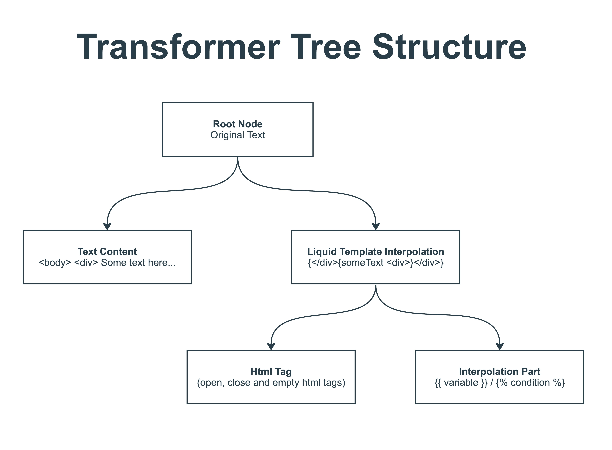
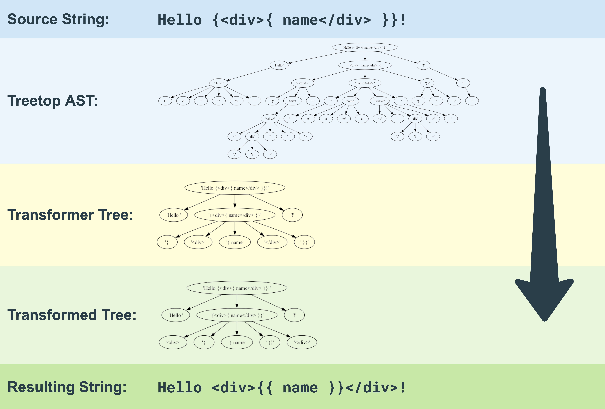

# Liquidice

Liquidice (Liquid-I-See) to indicate that it is related to part "What I See" of WYSIWYG abbreviation.

Use WYSIWYG editor output with the Liquid templating engine.

### Complications

It is often hard to use Liquid templates with WYSIWYG editor output, becaues WYSIWYG editor may add HTML tags to the template, causing errors.

For example, the Liquid template may be:
```html

  <p>I want Liquid and {{ wysiwygEditorName }} to be friends</p>

  Markdown is awesome too!

```

And a user of the WYSIWYG editor may enter it using different styles, without realizing it:
```html
  
    <p>I want Liquid and {<span>{ wysiwygEdito</span>rName }} to be friends</p>
  
    Markdown is awesome too!
  {<div class="useless-div-added-by-wysywig-for-no-reason"></div>% endif %}
```

One possible solution is to move the HTML tags away from the Liquid tags by placing opening tags to the left and closing tags to the right. This would result in the following:
```html
  <b></b>
    <p>I want Liquid and <span>{{ wysiwygEditorName }}</span> to be friends</p>
  
    Markdown is awesome too!
  <div class="useless-div-added-by-wysywig-for-no-reason"></div>
```
This modified template is now a valid Liquid template.

### Usage

```ruby
wysiwyg_liquid_template = <<~HTML
  <div class="wrapper">{<div class="c1"></div><div class="c2">{ v</div>a<div class="c3">rName</div>  }<div>}</div>
HTML

# Parse WYSIWYG output to AST
parser = Liquidice::Parser.new(strict_mode: true)
ast = parser.parse(wysiwyg_liquid_template)

# Transform AST to Liquid-compatible code
transformer = Liquidice::Transformer::Transformer.new
transformer_tree = transformer.apply(ast)
transformer_tree.transform!
valid_liquid_template = transformer_tree.to_s

# OR Do both in one step
valid_liquid_template = parser.parse_and_transform(wysiwyg_liquid_template)

puts valid_liquid_template
# <div class="wrapper"><div class="c1"></div><div class="c2"><div class="c3">{{ varName  }}</div></div><div></div>
```

## Details of the transformation

The string from WYSIWYG editor is parsed into an AST using Treetop gem. The AST is then transformed into a Transformer tree represented by `Liquidice::Transformer::Nodes::RootNode` objects. The tree is then transformed by calling `transform!` on the root node, which . The transformer tree have following structure:



While running `transform!` only Liquid Template Interpolation node changes the position of its children to separate HTML tags from Liquid interpolation instructions. The rest of the nodes are just placeholders for the HTML tags and another text. Here is a logic behind the transformation:
- in the left subtree of the Liquid Template Interpolation node, all HTML tags are moved to the left
- in the meedle of subtree open tags are moved to the left, and close tags are moved to the right
- in the right subtree of the Liquid Template Interpolation node, all HTML tags are moved to the right

Here is an example of the text transition:



## License

The gem is released under the [MIT License](https://opensource.org/licenses/MIT).
